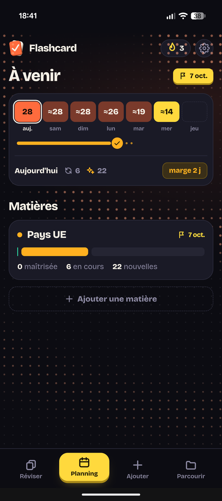
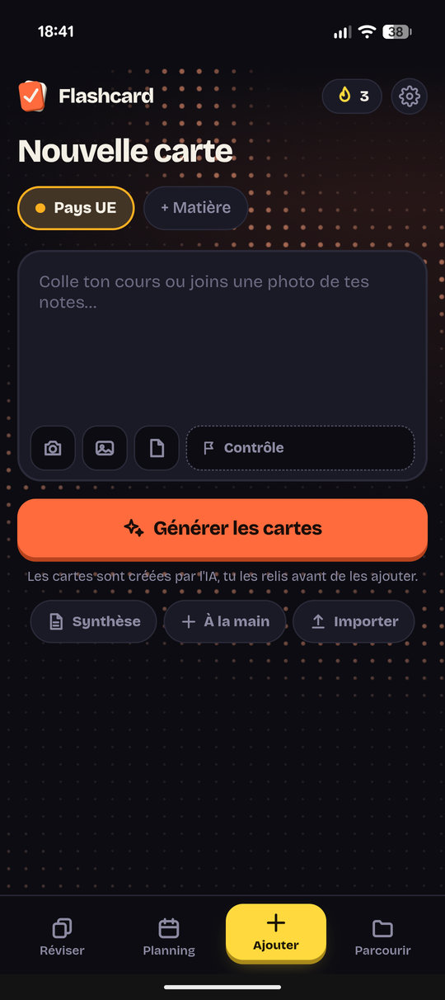

# 🃏 Flashcard

**Révise mieux, en moins de temps.** Une application de flashcards à répétition espacée, en français, qui s'installe comme une vraie app sur ton téléphone et fonctionne même sans connexion.


<!-- Ajoute ici 2 ou 3 captures d'écran :
<p align="center">
  
  
  
</p>
-->

---

## ✨ L'esprit de l'app

Flashcard est pensée pour être **fluide, vivante et cohérente**. Tout réagit au toucher : les boutons « s'enfoncent » comme de vrais boutons en relief, la carte se retourne avec une animation douce, et l'interface reste animée même au repos. Le style, appelé *Pop nuit*, mêle un fond sombre à des touches d'orange et de jaune, avec des cartes à l'ombre décalée.

## 🎯 Fonctionnalités

**Réviser**
- Répétition espacée : l'app te propose les cartes au bon moment, selon tes réponses (rouge, orange, vert).
- Boutons de réponse grands et toujours accessibles en bas de l'écran.
- Bouton « annuler » pour corriger une réponse donnée par erreur.
- Mode Quiz pour t'entraîner autrement.

**Ajouter des cartes**
- Génération de cartes par IA à partir de ton cours.
- Import simple de cartes (question / réponse).

**S'organiser avant un contrôle**
- **Matières et contrôles** : renseigne la date de tes contrôles.
- **Planning** : visualise ta semaine et ta marge avant chaque échéance.
- **Zone de révision avant contrôle** : les derniers jours, plus de cartes neuves, uniquement de la révision.
- Après la date du contrôle, la matière est archivée automatiquement et ses cartes sortent des révisions.

**Suivre sa progression**
- Statistiques et synthèse de ce que tu maîtrises.
- Parcourir toutes tes cartes, par matière.

## 📲 Installer l'application

**Sur Android (APK)**
1. Va dans la section [**Releases**](../../releases) de ce dépôt.
2. Télécharge le fichier `.apk` de la dernière version.
3. Ouvre-le et autorise l'installation depuis cette source si Android te le demande.

**Depuis le navigateur (PWA)**
1. Ouvre l'adresse de l'app dans Chrome.
2. Menu ⋮ → **Installer l'application** (ou **Ajouter à l'écran d'accueil**).

## 🔒 Tes données

Tes cartes et ta progression restent **sur ton appareil**. Il n'y a pas de compte à créer.

## 🛠️ Technique

- Application web progressive (PWA) : `index.html` + `manifest.json` + service worker `sw.js`
- HTML, CSS et JavaScript, sans framework
- Fonctionne hors ligne grâce au cache du service worker
- Dossier `worker/` : partie serveur légère utilisée pour la génération IA
- Hébergement : Cloudflare Pages

## 📁 Structure du dépôt

```
index.html       l'application complète
sw.js            service worker (mode hors ligne)
manifest.json    configuration PWA
icon-*.png       icônes de l'app
worker/          fonction serveur (génération IA)
docs/            documentation
.well-known/     liaison avec l'app Android
```

---

<p align="center">Fait avec ❤️ pour réviser sans stress.</p>

